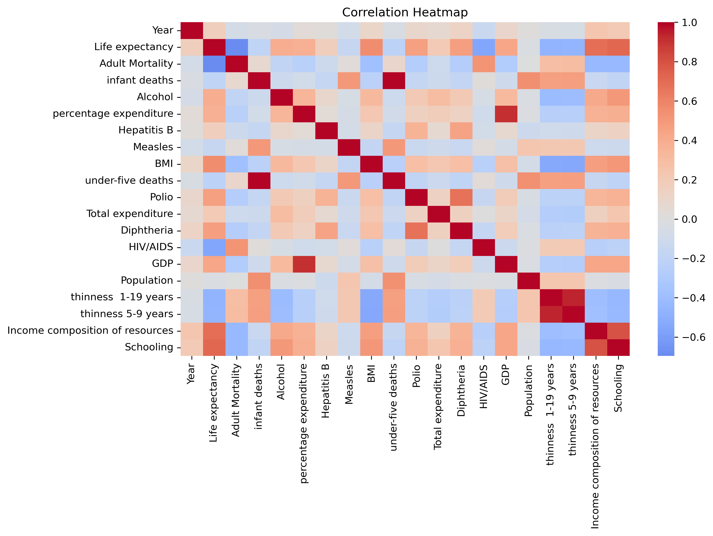
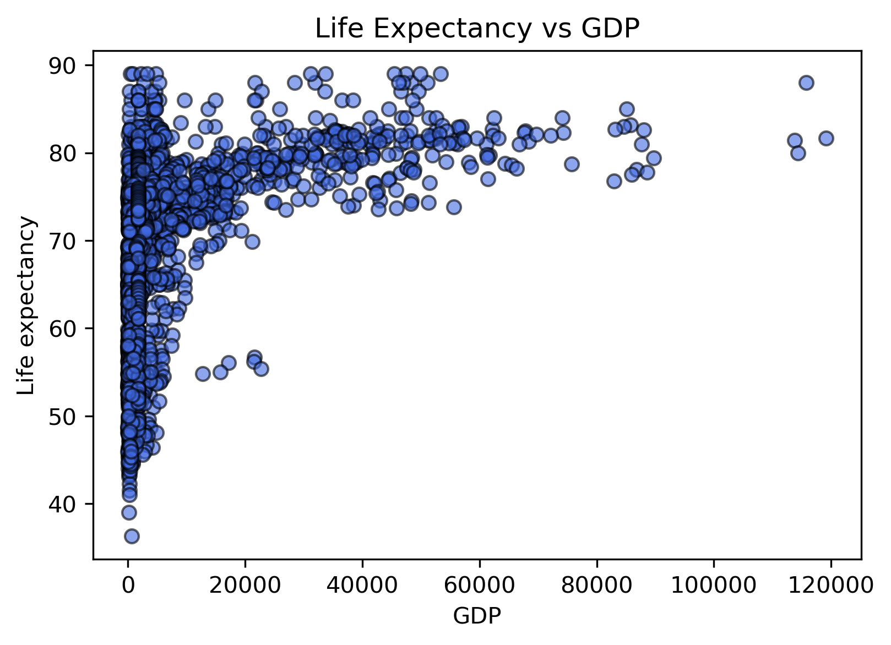
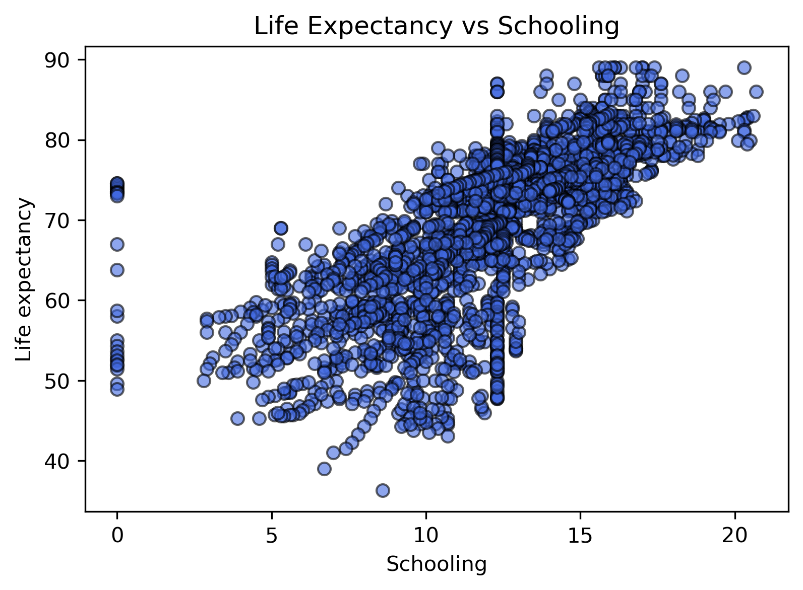

# 🌍 End-to-End Statistical Analysis of Global Life Expectancy (WHO)

This project explores how socioeconomic and health-related factors influence **global life expectancy** using data from the World Health Organization (WHO).  

It applies **descriptive statistics**, **hypothesis testing**, and **machine learning regression models** to uncover insights about human longevity across nations.

---

## 🎯 Objectives

- Analyze the relationship between GDP, schooling, health expenditure, and life expectancy.  

- Perform data cleaning, visualization, and feature correlation analysis.  

- Apply **linear regression** and **predictive modeling** to estimate life expectancy.  

- Interpret statistical findings to understand real-world implications.

---

## 🧠 Key Insights

📊 Countries with higher GDP, education levels, and healthcare investment show consistently higher life expectancy.  

🧬 Alcohol consumption and BMI have moderate but notable correlations with health outcomes.  

🌎 Schooling emerged as one of the **strongest predictors** of life expectancy globally.

---

## 🛠️ Tools & Libraries

- **Python**  

- **Pandas** – data cleaning and manipulation  

- **Matplotlib** & **Seaborn** – visualization  

- **SciPy** – hypothesis testing  

- **Scikit-learn** – regression and model evaluation  

---

## 📓 Notebook

[`life_expectancy_analysis_end_to_end.ipynb`](notebooks/life_expectancy_analysis_end_to_end.ipynb)

---

## 📁 Folder Structure

life-expectancy-analysis/

│

├── data/

│   ├── Life Expectancy Data.csv

│   └── life_expectancy_cleaned.csv

│

├── img/

│   ├── Life_Expectancy_vs_gdp.png

│   ├── Life_Expectancy_vs_schooling.png

│   ├── correlation_heatmap.png

│   └── distribution.png

│

├── notebooks/

│   └── life_expectancy_analysis_end_to_end.ipynb

│

└── README.md

---

## 🖼️ Visuals
Here are some sample outputs from the analysis:

### 🔹 Correlation Heatmap

### 🔹 GDP vs Life Expectancy

### 🔹 Schooling vs Life Expectancy  

### 🔹 Predicted vs Actual Life Expectancy

---

## 📊 Dataset
**Source:** [Life Expectancy (WHO)](https://www.kaggle.com/datasets/kumarajarshi/life-expectancy-who) by *Kumar Rajarshi*
**Description:** Includes 22 features (GDP, schooling, alcohol consumption, BMI, etc.) for 193 countries from 2000–2015.

---

## 💡 Conclusion
This project demonstrates the power of **data analytics and visualization** in uncovering relationships between health, economics, and education.
It also highlights how **machine learning models** can provide actionable insights for policymakers and global health initiatives.

---

## 👩🏽‍💻 Author

**Kanu Calista**  

📧 [kanucalista02@gmail.com](mailto:kanucalista02@gmail.com)  

💼 [LinkedIn](https://www.linkedin.com/in/kanu-calista) |  🐍 [GitHub](https://github.com/Kanu-Calista)

